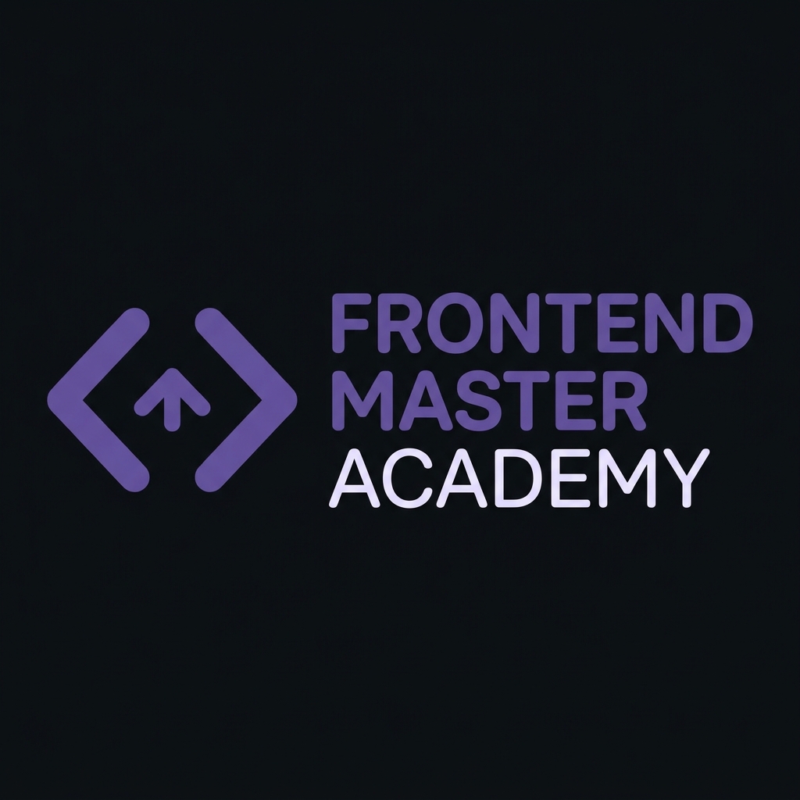
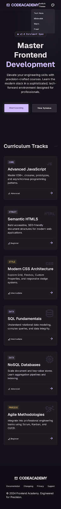
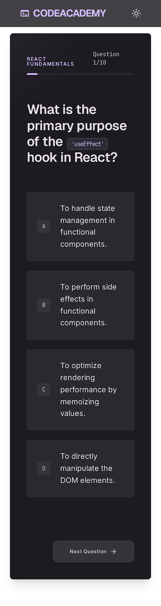
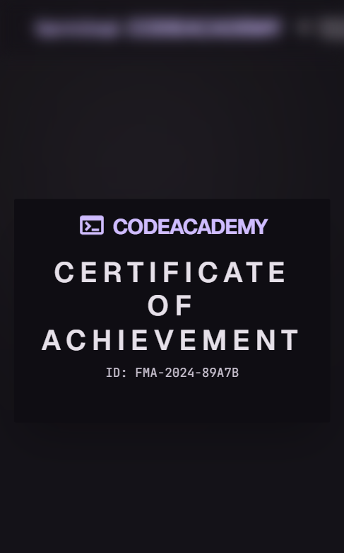

# Proyecto de clase - Programa Fullstack ITBA

---

## 🎨 Maquetado y Diseño (Stitch)

  

### Capturas de la interfaz

  
  &nbsp;
  

  

---

## 🚀 Despliegue en Vercel

* **Link de la aplicación:** [Ver proyecto en Vercel](https://vercel.com/trini-ramos-projects/academia-front/GTZdN6ggTxjLEETiFDn1YYVzT4wy)

---

## ⚠️ Aclaración para el despliegue

Al momento de configurar o subir el proyecto en **Vercel**, es importante asegurarse de:

> **Cambiar el `Root Directory` a `academy_app`**
>
> *(Dado que el archivo `index.html` se encuentra dentro de esa carpeta).*
